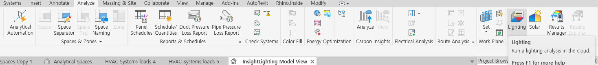
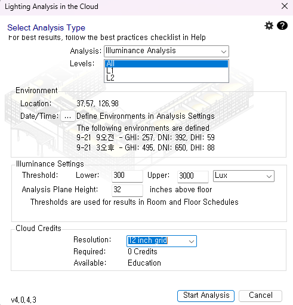

# 💡 Revit 조도 해석(Lighting Analysis) 설정 가이드

레빗의 **'Lighting Analysis in the Cloud'** 기능은 컴퓨터 자원 대신 오토데스크 클라우드 서버를 이용해 공간의 밝기(Lux)를 시뮬레이션하는 도구입니다.

이 문서는 해석 설정 창의 각 항목별 의미와 실무에서의 최적 설정값, 그리고 해석 데이터의 활용 방안을 정리합니다.

---

## 설정 화면

## 1. 설정 항목 상세 분석 (Settings Breakdown)

| 설정 항목 (Item) | 현재 설정값 (Default) | 의미 및 설명 | 실무 활용 팁 |
| :--- | :--- | :--- | :--- |
| **Analysis Type** (해석 유형) | `Illuminance Analysis` | **공간의 밝기(Lux) 측정** 바닥이나 작업면에 빛이 얼마나 도달하는지 계산합니다. | 가장 기본적인 빛 환경 분석 도구입니다. |
| **Levels** (분석 레벨) | `All` / `L1`... | **분석할 층 선택** 건물 전체(`All`) 또는 특정 층만 선택 가능합니다. | 시간이 부족할 땐 `L1`처럼 특정 층만 선택해 테스트하는 것이 효율적입니다. |
| **Date/Time** (날짜/시간) | `9/21 9am - 3pm` | **태양 위치 기준일** 일반적으로 **춘분/추분(9월 21일)**을 기준으로 합니다. | **LEED/친환경 인증 표준**입니다. 1년 중 태양 고도가 가장 평균적인 날을 기준으로 평가합니다. |
| **Threshold** (임계값) | Lower: `300 Lux` Upper: `3000 Lux` | **합격/불합격 기준 범위** • **300:** 사무 업무를 위한 최소 밝기 • **3000:** 눈부심(Glare)이 발생하는 한계선 | 보고서에서 이 범위 내에 들어오는 면적(%)을 자동으로 계산해 줍니다. |
| **Plane Height** (작업면 높이) | `32 inches` (약 81cm) | **빛을 측정하는 높이** 바닥(0)이 아닌 **책상 높이**에서 측정합니다. | 사람은 책상 위에서 일하기 때문에 바닥에서 띄워서 측정하는 것이 정확합니다. |
| **Resolution** (해상도) | `12 inch grid` (약 30cm) | **측정 센서 간격** 값이 작을수록 촘촘하고 정밀합니다. | 12인치는 매우 정밀한 수준이며, 해상도가 높을수록 해석 시간이 길어집니다. |

 

## 2. 변수 조절에 따른 변화 (What If?)

설정값을 변경했을 때 결과가 어떻게 변하는지 이해하면 상황별 대처가 가능합니다.

* **📅 날짜를 12월(동지)로 바꾸면?**
    * 태양 고도가 낮아져 빛이 방 안쪽 깊숙이 들어오지만, 낮 길이가 짧아져 전체적인 평균 조도는 낮아질 수 있습니다.
* **📏 작업면 높이를 0 inch로 하면?**
    * 책상이 없는 **복도, 로비, 강당** 등의 바닥 밝기를 분석할 때 사용합니다.
* **🎯 임계값(Lower)을 500 Lux로 높이면?**
    * **정밀 작업(제도, 수술 등)**이 필요한 공간의 기준을 잡을 때 사용합니다. 기준이 엄격해집니다.

 

## 3. 데이터 활용 및 기대 효과 (Utilization)

이 해석 데이터를 통해 생성된 **빛의 지도(Heatmap)**와 수치 데이터는 다음과 같이 활용됩니다.

### 🌿 친환경 인증 (LEED / G-SEED)
> *"우리 건물은 업무 시간 중 75% 이상의 공간이 조명을 켜지 않고도 300 Lux 이상을 유지합니다."*
* **자연채광 확보** 항목의 증빙 자료로 제출하여 점수(Credit)를 획득합니다.
* 전기 에너지 절감 효과를 입증할 수 있습니다.

### 🛋️ 공간 배치 계획 (Space Planning)
* **눈부심 방지:** 창가 쪽 조도가 `3000 Lux`를 넘는 구역(Red Zone)에는 모니터를 배치하지 않고 휴게 공간으로 계획합니다.
* **조명 보완:** 자연광이 `300 Lux`에 미치지 못하는 구역(Blue Zone)을 파악하여 인공 조명 라인을 추가 배치합니다.

### 🏢 디지털 트윈 (Digital Twin / Tandem)
* **쾌적도 시각화:** 열 부하(Cooling Load)처럼 각 방의 **평균 조도값**을 텐덤 데이터로 입력합니다.
* **시설 관리:** *"이 회의실은 너무 어두우니 조명을 교체하거나 블라인드를 걷어야 한다"*는 의사결정의 근거가 됩니다.

---

> **🚀 Next Step for Intern**
>
> 현재 설정된 값(`9/21`, `300~3000 Lux`, `32 inches`)은 **오피스 빌딩 설계의 표준(Standard)** 설정입니다.
> 교육용 라이선스(Education) 사용 시 해석 크레딧이 무료이므로, **[Start Analysis]**를 눌러 결과를 확인하고 디지털 트윈에 입힐 데이터를 뽑아보세요!