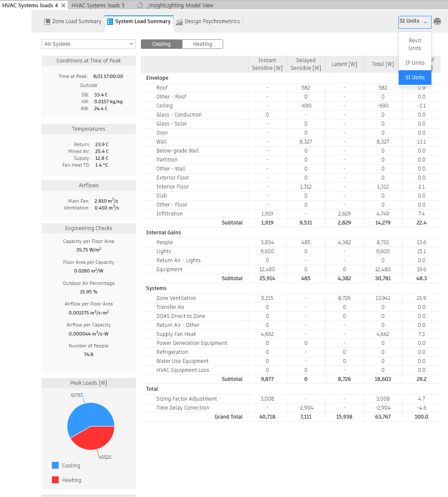

# 05. Revit Energy Analysis 단위(Units) 설정 가이드

Revit에서 에너지 해석(Systems Analysis)을 수행할 때, 보고서에 표시되는 **단위(Unit)** 설정은 데이터의 신뢰성과 후속 활용에 직접적인 영향을 미칩니다.

본 문서는 Revit의 3가지 단위 옵션의 차이점과 한국 실무 및 디지털 트윈 프로젝트에서의 권장 설정을 정리합니다.

---

## 설정 화면

## 1. 단위 옵션별 상세 비교표

| 옵션 이름 | 풀네임 (의미) | 설명 및 특징 | 주요 단위 예시 |
| :--- | :--- | :--- | :--- |
| **IP Units** | Inch-Pound Units | • **미국식 야드파운드법**입니다. • 미국 프로젝트가 아니면 잘 쓰지 않습니다. • 현재 보고서가 이 단위로 나오고 있습니다. | • 열량: `Btu/h` • 온도: `°F` (화씨) • 면적: `ft²` (평방피트) |
| **SI Units** | Système International | • **국제 표준 미터법**입니다. • **한국(KS)**을 포함한 전 세계 표준입니다. • **무조건 이것을 선택**해야 합니다. | • 열량: `W` (와트) 또는 `kW` • 온도: `°C` (섭씨) • 면적: `m²` (평방미터) |
| **Revit Units** | Project Units | • **현재 레빗 파일의 설정**을 따라갑니다. • 레빗 프로젝트 단위 설정(`UN`)이 mm로 되어 있으면 SI로, 인치로 되어 있으면 IP로 나옵니다. | (파일 설정에 따라 다름) |

 

## 2. 현재 모델 상황 분석 (Case Study)

현재 진행 중인 프로젝트의 에너지 해석 보고서를 분석한 결과입니다.

* **현재 상태:** `Peak Cooling Load`가 **115,888 Btu/hr**, 외기 온도가 **90.6°F**로 표기
* **판단:** **IP Units(미국식)** 단위가 적용된 상태
* **문제점:** 국내 보고서 또는 디지털 트윈 플랫폼에 데이터를 연동할 경우 별도의 단위 환산 과정이 필요하여 비효율 발생

 

## 3. 🌟 전문가 권장 설정 (Recommendation)

보고서 상단의 드롭다운 메뉴에서 **[SI Units]**로 변경할 것을 권장합니다. 변경 시 데이터는 다음과 같이 변환됩니다.

* **냉방 부하:** 115,888 Btu/h → **약 33.9 kW**
* **외기 온도:** 90.6°F → **약 32.5°C** (한여름 기준)
* **면적:** ft² → **m²**

> **Digital Twin 연동 시 고려사항**
>
> 디지털 트윈 플랫폼에서는 **가상 모델의 설계값**과 **실제 센서 데이터**를 비교 분석합니다.
> * 국내 스마트 계량기 및 전력 고지서는 **`kWh`** 또는 **`kW`** 단위를 사용
> * Revit 데이터를 SI 단위로 설정하면 별도의 환산 없이 **설계값 대비 실측값 비교**가 즉시 가능