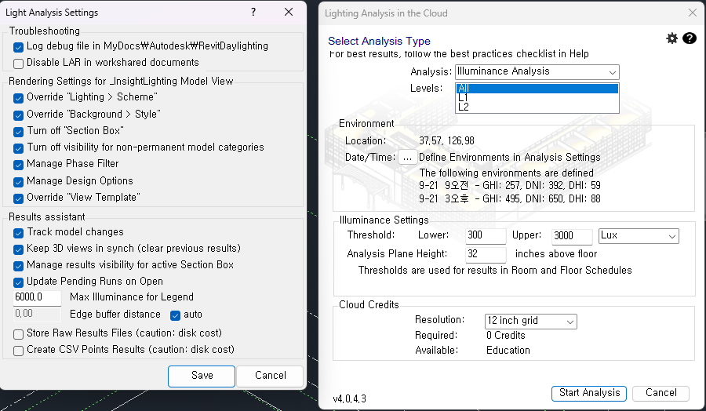

# 02. Revit Lighting Analysis 고급 설정 가이드

본 문서는 Revit 조명 분석 시 **`_InsightLighting Model View`** 3D 뷰의 속성을 제어하는 고급 설정창에 대한 상세 설명입니다.

해당 설정은 분석의 **정확도**, **속도**, 그리고 **가시성**을 결정하는 핵심 옵션입니다.

---

## 설정 화면

## 1. 렌더링 설정 (Rendering Settings)
이 옵션들은 분석을 수행할 때 레빗이 자동으로 **`_InsightLighting Model View`**의 뷰 설정을 어떻게 변경할지 결정합니다.

<strong>✅ Override "Lighting > Scheme" (조명 구성표 재정의)</strong>

 

* **설명:** 뷰의 조명 설정을 강제로 **"Interior: Sun only (실내: 태양광만)"**으로 변경합니다.
* **작동 원리:** 인공 조명(형광등 등)을 끄고 순수하게 태양광만 계산하도록 합니다.
* **💡 실무 활용 (Utilization):**
    * **친환경 인증(LEED):** 자연채광 성능만 평가해야 하므로 반드시 켜져 있어야 합니다.
    * **에러 방지:** 실수로 켜놓은 인공 조명 때문에 결과가 왜곡되는 것을 막아줍니다.

<strong>✅ Override "Background > Style" (배경 스타일 재정의)</strong>

 

* **설명:** 배경 스타일을 **"Sky: No clouds (하늘: 구름 없음)"**으로 설정합니다.
* **작동 원리:** 구름에 의한 변수를 제거하고 CIE 표준 담천공(Standard Overcast Sky) 또는 청천공 모델을 명확하게 적용하기 위함입니다.
* **💡 실무 활용:**
    * **시각화:** 결과 보고서 이미지가 깔끔하게 출력됩니다.

<strong>✅ Turn off "Section Box" (단면 상자 끄기)</strong>

 

* **설명:** 3D 뷰의 **단면 상자(Section Box)** 기능을 자동으로 끕니다.
* **이유:** 단면 상자가 켜져서 건물의 지붕이나 벽이 잘린 상태로 분석되면, 그 틈으로 빛이 쏟아져 들어와 **결과값이 폭주(오류)**합니다.
* **💡 주의사항:**
    * 특정 층만 분석하고 싶어서 단면 상자를 썼더라도, 분석 시에는 끄는 것이 안전합니다. (층 구분은 Analysis Levels에서 설정하는 것이 정석입니다.)

<strong>✅ Turn off visibility for non-permanent model categories (비영구 모델 카테고리 숨기기)</strong>

 

* **설명:** **가구(Furniture), 가구 시스템, 조경(Planting), 주변 환경(Entourage)** 카테고리를 자동으로 숨깁니다.
* **작동 원리:** 빛을 가리는 '이동 가능한 물체'들을 계산에서 제외합니다.
* **💡 실무 활용 (Utilization):**
    * **속도 향상:** 복잡한 가구 메쉬를 계산하지 않아 클라우드 해석 속도가 훨씬 빨라집니다.
    * **정확한 바닥 조도:** 책상 밑이나 의자 밑이 까맣게 나오는 것을 방지하고, 방 전체의 평균적인 빛 성능을 봅니다.

<strong>✅ Manage Phase Filter (단계 필터 관리)</strong>

 

* **설명:** 뷰의 단계 필터를 **"Show Complete (완료 표시)"**로 설정합니다.
* **내용:**
    * **표시:** 신규(New) + 기존(Existing) 요소
    * **숨김:** 철거(Demo) + 임시(Temporary) 요소
* **💡 실무 활용:**
    * **리모델링 프로젝트:** 철거될 벽이 빛을 막고 있는 것으로 계산되는 오류를 방지합니다. 현재 최종적으로 남을 벽체 기준으로만 해석합니다.

<strong>✅ Override "View Template" (뷰 템플릿 재정의)</strong>

 

* **설명:** 3D 뷰에 적용된 뷰 템플릿을 **`<None>`(없음)**으로 설정합니다.
* **이유:** 뷰 템플릿이 잠겨 있으면 클라우드 서버가 해석 결과를 보여주는 '히트맵(알록달록한 지도)' 스타일을 적용할 수 없습니다.
* **💡 팁:** 분석 결과가 화면에 안 보인다면 이 옵션이 꺼져 있는지 확인하세요.

 

## 2. 결과 도우미 (Results Assistant)
분석이 끝난 후 결과를 화면에 어떻게 보여줄지 제어하는 설정입니다.

<strong>⚙️ Track model changes (모델 변경 추적)</strong>

 

* **설명:** 모델(벽, 창문 등)이 수정되었을 때, 기존 분석 결과가 유효하지 않음을 알립니다.
* **활용:** 모델 변경 후 이전 분석 결과가 그대로 표시되는 혼선을 방지합니다.

<strong>⚙️ Manage results visibility for active Section Box (활성 단면 상자에 대한 결과 가시성 관리)</strong>

 

* **설명:** 분석 **후** 결과를 볼 때, 단면 상자로 건물을 자르면 그 잘린 단면의 결과(Analysis Plane)도 같이 깔끔하게 잘라서 보여줍니다.
* **활용:** 건물 내부 심층부의 분석 결과를 단면으로 절단하여 확인할 때 유용합니다.

<strong>📏 Edge buffer distance (모서리 버퍼 거리)</strong>

 

* **설명:** 벽체에서 얼마나 떨어진 곳부터 측정을 시작할지 결정합니다.
* **값:** `Auto` (자동) 또는 사용자 입력
* **이유:** 벽에 딱 붙은 지점은 계산 오류가 많거나 의미 없는 값인 경우가 많아, 보통 벽에서 **15~30cm 정도 떨어뜨려서(Buffer)** 계산합니다.

